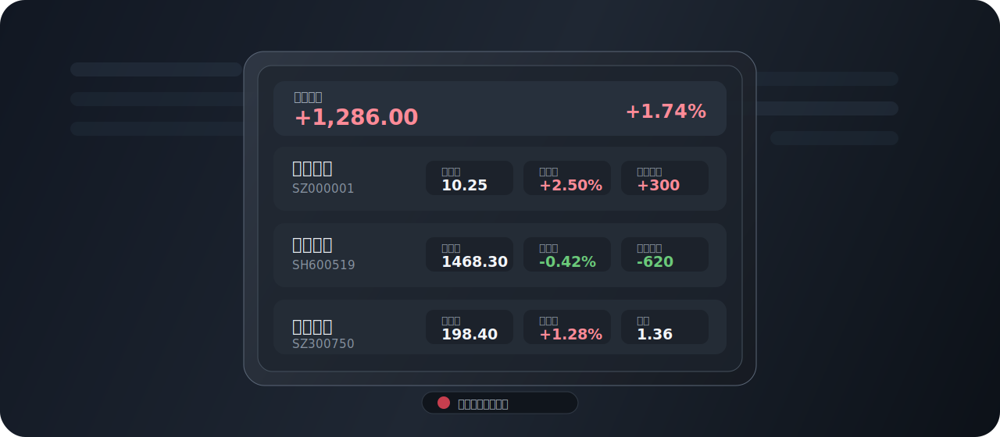
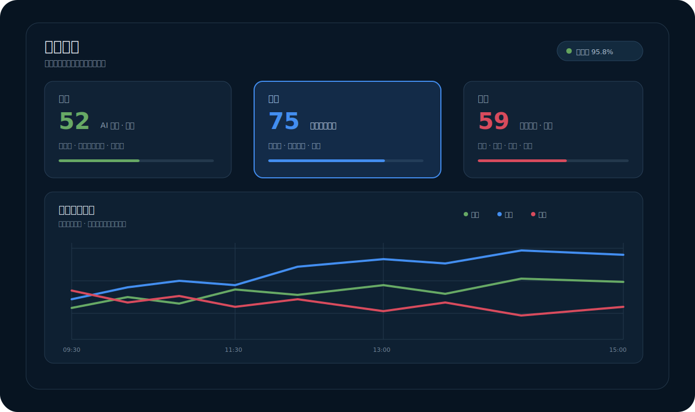
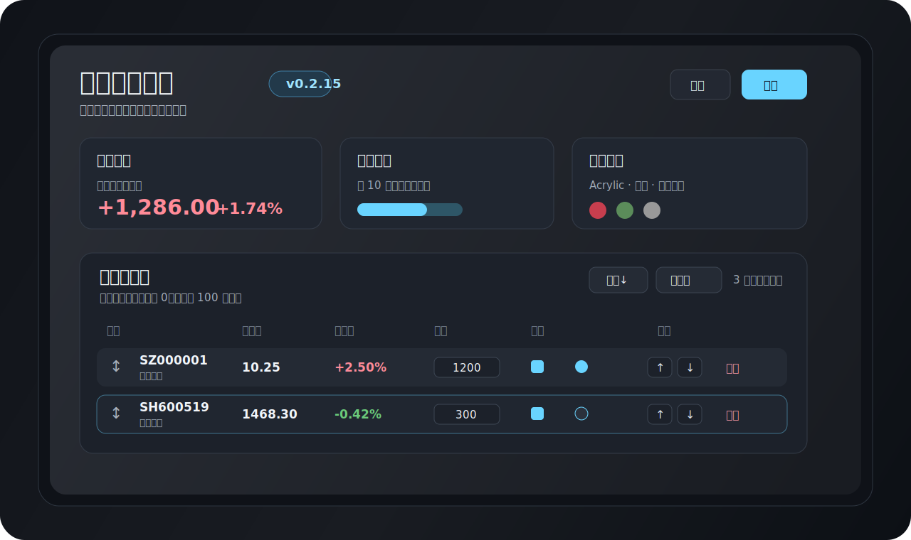

<div align="center">

<picture>
  <source media="(prefers-color-scheme: dark)" srcset="docs/assets/stocktray-wordmark-dark.svg" />
  
</picture>

### 看一眼行情，然后继续工作。

一款安静待在 Windows 系统托盘里的 A 股行情工具。<br />
点击出现，移开自动隐藏；不用切换页面，也不占用你的桌面。

[](https://github.com/keyu-0915/StockTray/releases/latest)
[](https://github.com/keyu-0915/StockTray/releases/latest)
[](https://tauri.app/)
[](LICENSE)

[官网](https://keyu-0915.github.io/StockTray/) · [下载最新版](https://github.com/keyu-0915/StockTray/releases/latest) · [版本记录](RELEASES.md) · [开发文档](docs/DEVELOPMENT.md)

</div>

---

## 为什么是托盘

StockTray 不想成为又一个铺满屏幕的行情终端。它更像工作电脑上的一个安静入口：平时藏在系统托盘，需要时点一下，在一张紧凑浮窗里看完自选、持仓盈亏和市场方向，然后回到手上的事情。

- **不抢桌面**：启动后常驻系统托盘，不需要一直开着主窗口。
- **打开就看**：左键托盘图标显示行情，右键进入菜单。
- **看完即走**：支持鼠标移开自动隐藏、悬停保持、透明度和圆角调整。
- **两只刚好**：弹窗完整展示两只股票，其余内容向下滚动，保持紧凑。
- **数据在本机**：没有账号体系，自选、持仓、成本和历史默认保存在本地。

## 一眼看完

<p align="center">
  
</p>

弹窗可按需组合最新价、涨跌额、涨跌幅、昨收、今开、最高、最低、成交量、成交额、量比、换手率、持仓、成本、当日盈亏与持仓盈亏等字段。托盘状态也会跟随总持仓盈亏变化，不打开弹窗也能快速感知今天的状态。

## 多看懂一步

<p align="center">
  
</p>

市场风格是托盘速览之外的一层判断。StockTray 不把“小登—中登—老登”理解成一条年龄轴，而是三类相互独立、同时竞争有限资金的方向：

| 风格 | 主要观察方向 | 典型特征 |
| --- | --- | --- |
| **小登** | AI 硬件、半导体、算力基础设施、光通信 | 成长、弹性、科技驱动 |
| **中登** | 机器人、商业航天、游戏 | 主题轮动、事件驱动、高弹性 |
| **老登** | 红利、金融、消费、能源、大盘价值 | 稳健、防御、价值与股息 |

分析综合成分股收益、上涨广度、活跃度、宽基指数证据与风格间相对收益；成分股按流通市值赋权并限制集中度。只有样本覆盖率、时间戳和指数证据满足质量门槛时才输出明确倾向，否则会如实显示数据不足或弱信号。

你可以进一步查看：

- 三类风格的盘中得分与 09:30–15:00 全天趋势；
- 主要贡献方向、具体成分股、涨跌幅、权重与贡献；
- 当前倾向、共同走强、普遍偏弱与快速轮动状态；
- 样本覆盖率、数据质量和算法版本。

## 设置得像你自己的工具

<p align="center">
  
</p>

自选与持仓支持拖动排序；弹窗字段、自动隐藏、透明度、圆角、主题和刷新频率都可以调整。行情数据源同样按拖动顺序读取，失败时自动尝试下一个来源。

### 数据源

- 东方财富：默认主数据源；
- 腾讯行情：内置备用；
- 富途 OpenD：可填写自建服务器地址与端口，在客户端测试连接并参与自动降级。

Linux OpenD 的 Docker 部署示例位于 [`deploy/futu-opend`](deploy/futu-opend/README.md)。建议通过局域网、VPN 或 SSH 隧道访问，不建议直接把 OpenD TCP 端口暴露到公网。

### 本地历史

市场风格当日快照与历史归档默认保存在：

```text
%APPDATA%\StockTray\market-snapshots.json
%APPDATA%\StockTray\market-history.json
```

每个交易日可保留最终分析、成分贡献、盘中趋势点以及样本/算法版本。设置页可以统计交易日数量、趋势点数量和磁盘占用，也可以按日期删除或清空历史。

## 技术架构

```text
StockTray
├── Tauri 2 / Rust
│   ├── 系统托盘与窗口控制
│   ├── 行情抓取与数据源降级
│   ├── 配置迁移、盈亏计算与本地存储
│   └── Windows 打包与更新
└── React / TypeScript
    ├── 托盘行情弹窗
    ├── 设置与自选持仓管理
    └── 市场风格、贡献拆解与盘中趋势
```

## 本地开发

### 环境要求

- Node.js 18+
- Rust stable，目标 `x86_64-pc-windows-msvc`
- Visual Studio 2022 Build Tools（包含 C++ MSVC 工具链）
- Microsoft Edge WebView2 Runtime

### 启动

```powershell
npm install
npm run tauri:dev
```

### 检查与打包

```powershell
npm run build
cargo check --manifest-path src-tauri/Cargo.toml
npm run release
```

安装包输出到：

```text
releases/韭菜托盘_<version>_x64-setup.exe
```

## 项目结构

```text
.
├── src/                  # React 前端：设置页、弹窗与交互
├── src-tauri/            # Rust/Tauri：托盘、窗口、行情与存储
├── docs/                 # 官网、架构与发布文档
├── deploy/futu-opend/    # Linux OpenD Docker 部署示例
├── scripts/              # 图标、打包与发布脚本
├── RELEASES.md           # 完整版本记录
└── package.json
```

## 文档

- [架构说明](docs/ARCHITECTURE.md)
- [开发与发布流程](docs/DEVELOPMENT.md)
- [完整版本记录](RELEASES.md)
- [v0.2.19 发布说明](docs/RELEASE-v0.2.19.md)

## 说明

StockTray 只用于个人行情查看与市场观察，不提供交易能力，也不构成任何投资建议。行情来源可能存在延迟、限流或短暂不可用，请以交易所和持牌机构发布的信息为准。

## 许可证

本项目采用 [GNU General Public License v3.0 or later](LICENSE)。你可以自由使用、复制、分发和修改；如果分发修改版或衍生版本，需要继续遵守 GPL 的源码开放与再分发条款。
